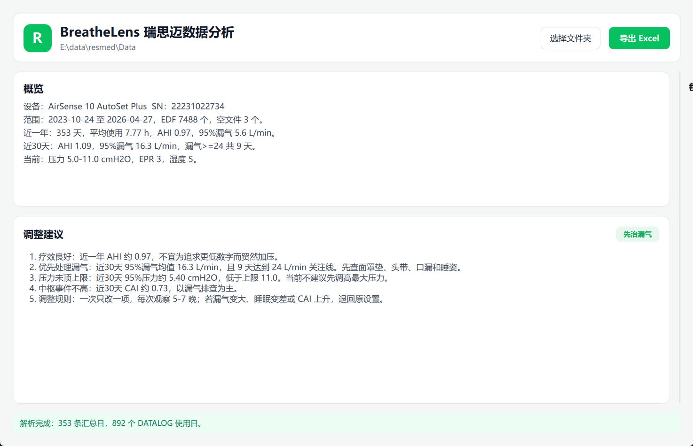

# BreatheLens

BreatheLens（呼吸镜）是一个本地运行的瑞思迈 CPAP / APAP 数据分析工具。它读取 ResMed 呼吸机 SD 卡目录，自动解析 EDF 数据，生成每日表格、治疗概览、漏气观察表和调机建议。

本项目面向需要快速查看瑞思迈数据的人：无需上传云端，不依赖 OSCAR 数据库，直接选择包含 `STR.edf`、`DATALOG`、`SETTINGS` 的文件夹即可分析。



## 功能

- 选择瑞思迈 SD 卡数据文件夹
- 自动识别设备型号与序列号
- 解析 `STR.edf` 每日汇总
- 解析 `DATALOG/*_PLD.edf` 会话时长
- 解析 `DATALOG/*_EVE.edf` 事件注释
- 展示每日使用时长、AHI、CAI、OAI、95%漏气、95%压力
- 使用后台线程解析大目录，界面保持可操作，并显示实时进度
- 内置关键指标曲线图：AHI、95%漏气、95%压力
- 提供 STR 汇总、DATALOG 会话事件、漏气观察三类明细表格
- 自动给出调整建议：优先判断漏气、压力是否顶上限、中枢事件是否偏高
- 导出 Excel，包含 Summary、STR_Daily、DATALOG_Daily、Leak_Watch、Suggestions、Codebook
- PySide6 + QML 界面，微信绿色风格，简单高效
- Nuitka 单文件打包

## 数据说明

BreatheLens 主要读取以下文件：

| 文件 | 用途 |
| --- | --- |
| `Identification.tgt` | 设备型号、序列号 |
| `STR.edf` | 每日治疗汇总，含 AHI、漏气、压力、设置 |
| `DATALOG/*_PLD.edf` | 会话时长与低频治疗曲线 |
| `DATALOG/*_EVE.edf` | 呼吸事件注释 |

报告中的建议以数据趋势为依据，不能替代医生诊断。若出现 CAI 持续升高、夜间低氧、胸闷心悸、明显嗜睡等情况，应携带原始数据就医。

## 开发运行

```powershell
uv venv .venv
uv sync
uv run python main.py
```

## 本地打包

```powershell
uv run python build.py
```

输出位于 `dist/`，例如：

```text
dist/BreatheLens.exe
dist/BreatheLens-windows-x64.zip
```

## GitHub Actions 发布

仓库内置 `.github/workflows/release.yml`：

- push tag `v*` 时自动构建并发布 Release
- 默认构建 GitHub 托管 runner 支持的平台：
  - Windows x64
  - Windows x86
  - Windows ARM64
  - macOS Apple Silicon arm64
  - macOS Intel x64
  - Linux x64
  - Linux ARM64
- 其他平台需要自托管 runner：
  - Linux x86：标签 `self-hosted, linux, X86`
  - Linux LoongArch64 / 龙芯：标签 `self-hosted, linux, LoongArch64`

手动触发 workflow 时，可打开 `build_self_hosted` 来构建这些自托管平台。原因是 Nuitka + PySide6 本质上应在目标系统/架构原生编译；若没有对应 runner，GitHub Actions 无法凭空交叉编译 Qt GUI 程序。

发布方式：

```bash
git tag v0.1.0
git push origin v0.1.0
```

也可以手动触发 workflow，并填写 `release_tag`，例如 `v0.1.0`。

## 许可证

MIT License。详见 [LICENSE](LICENSE)。
