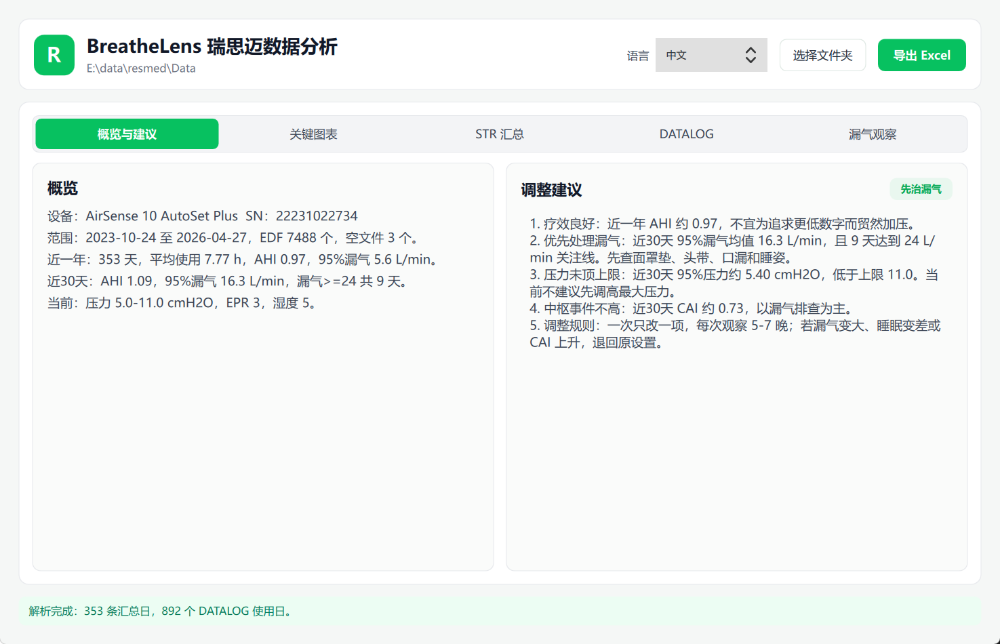
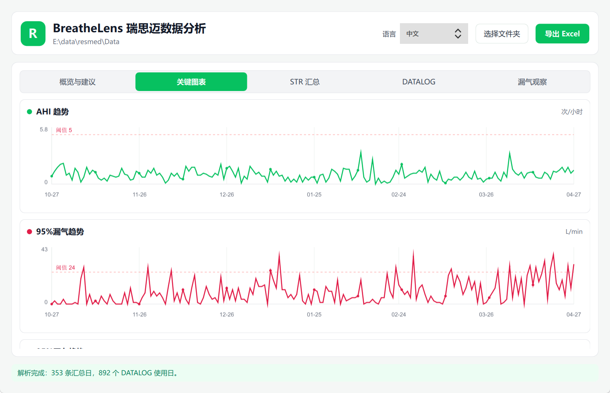
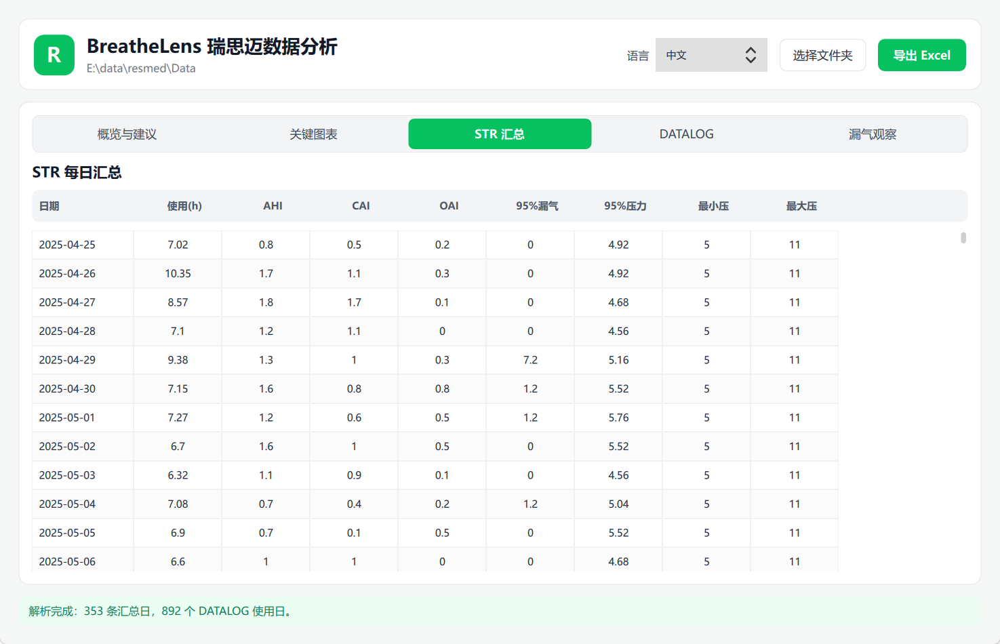
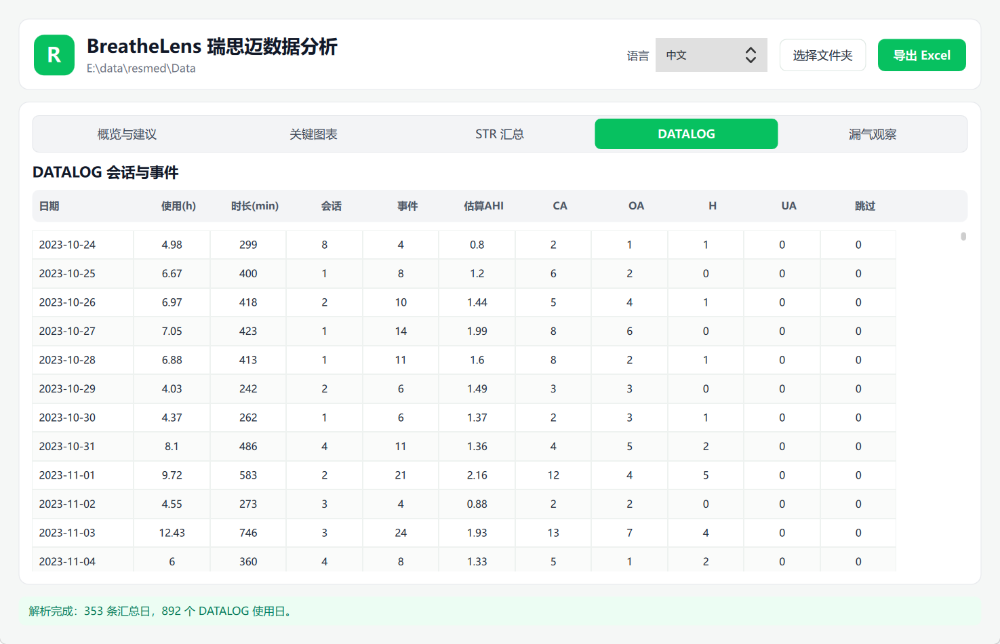
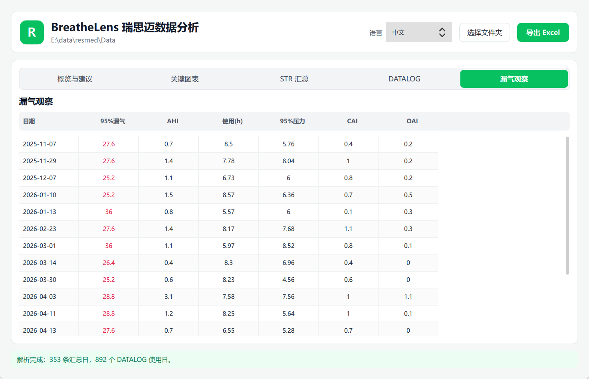

# BreatheLens

<div dir="rtl">

[English](../../README.md) | [中文](README.zh.md) | [Deutsch](README.de.md) | [Français](README.fr.md) | [Русский](README.ru.md) | [Español](README.es.md) | [Português](README.pt.md) | [日本語](README.ja.md) | [한국어](README.ko.md) | العربية

BreatheLens هو محلل محلي لبطاقات SD الخاصة بأجهزة ResMed CPAP / APAP. يقرأ مجلد بطاقة SD الأصلي، ويحلل ملفات EDF، ثم ينشئ جداول يومية ورسوم اتجاه ومراجعة للتسرب وتقارير Excel واقتراحات لضبط الضغط.

الأداة موجهة لمن يريد فحص بيانات ResMed بسرعة من دون رفعها إلى السحابة ومن دون استيراد قاعدة OSCAR. اختر المجلد الذي يحتوي على `STR.edf` و `DATALOG` و `SETTINGS` لبدء التحليل محليا.

## لقطات الشاشة











## الميزات

- اختيار مجلد بيانات بطاقة SD من ResMed.
- كشف طراز الجهاز والرقم التسلسلي.
- تحليل ملخص العلاج اليومي من `STR.edf`.
- تحليل مدة الجلسات من `DATALOG/*_PLD.edf`.
- تحليل أحداث التنفس من `DATALOG/*_EVE.edf`.
- عرض مدة الاستخدام اليومية و AHI و CAI و OAI والتسرب 95% والضغط 95%.
- تبديل لغة الواجهة: الصينية والإنجليزية والألمانية والفرنسية والروسية والإسبانية والبرتغالية واليابانية والكورية والعربية.
- تحليل المجلدات الكبيرة في الخلفية مع عرض التقدم.
- رسوم بيانية لـ AHI والتسرب 95% والضغط 95%.
- جداول لملخص STR وجلسات DATALOG ومراجعة التسرب.
- اقتراحات مبنية على التسرب، وبلوغ الضغط الحد الأعلى، وارتفاع الأحداث المركزية.
- تصدير Excel يحتوي على `Summary` و `STR_Daily` و `DATALOG_Daily` و `Leak_Watch` و `Suggestions` و `Codebook`.
- واجهة سطح مكتب PySide6 + QML.
- بناء ملف تنفيذي واحد باستخدام Nuitka.

## البيانات المقروءة

| الملف | الغرض |
| --- | --- |
| `Identification.tgt` | طراز الجهاز والرقم التسلسلي |
| `STR.edf` | ملخص يومي يشمل AHI والتسرب والضغط والإعدادات |
| `DATALOG/*_PLD.edf` | مدة الجلسات وإشارات العلاج منخفضة التردد |
| `DATALOG/*_EVE.edf` | تعليقات أحداث التنفس |

تعتمد الاقتراحات على اتجاهات البيانات. وهي ليست تشخيصا طبيا ولا تغني عن الرعاية المتخصصة. إذا بقي CAI مرتفعا، أو حدث نقص أكسجين ليلي، أو ضيق صدر، أو خفقان، أو نعاس نهاري واضح، فاعرض البيانات الأصلية على طبيب.

## التطوير

```powershell
uv venv .venv
uv sync
uv run python main.py
```

## البناء المحلي

```powershell
uv run python build.py
```

توجد المخرجات في `dist/`، مثل `dist/BreatheLens.exe`.

## النشر

يبني workflow الموجود في `.github/workflows/release.yml` الوسوم `v*` وينشرها. عند التشغيل اليدوي يمكن إدخال `release_tag`. يحتاج Linux x86 و Linux LoongArch64 إلى runners ذاتية الاستضافة مناسبة.

## الرخصة

MIT License. راجع [LICENSE](../../LICENSE).

</div>
